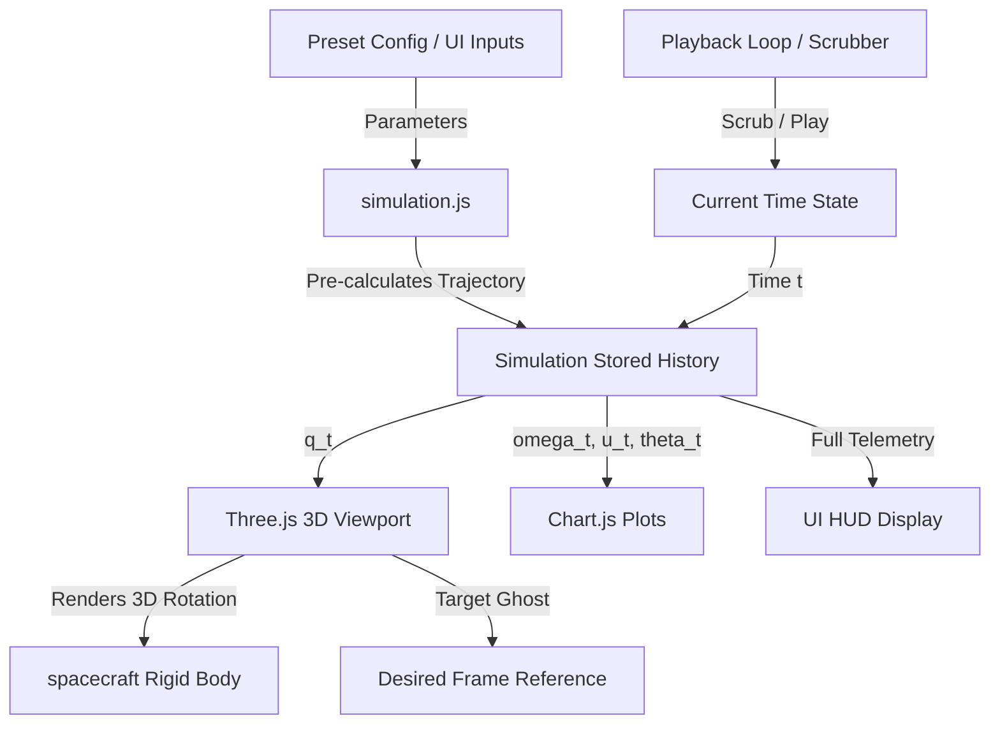

<p align="center">
  
</p>

#A Simple Structure Constrained Attitude Control for Rigid Bodies: A PD-Type Control

<div align="center">

[](https://www.python.org/)
[](https://pytorch.org/)
[](https://www.mathworks.com/)
[](LICENSE)

**Group-AB02 | INTRODUCTION TO DRONES | Amrita Vishwa Vidyapeetham**

</div>

---

## Team Members

| Name | Roll Number |
|------|------------|
| Nethra R | CB.SC.U4AIE24147 |
| Dheeraj S | CB.SC.U4AIE24050 |
| Raaman Namputhiri | CB.SC.U4AIE24148 |
| Jyothsna | CB.SC.U4AIE24117 |

---

## Table of Contents
1. [Project Overview](#project-overview)
2. [Key Features](#key-features)
3. [Mathematical Formulation](#mathematical-formulation)
   - [Spacecraft Attitude Kinematics](#spacecraft-attitude-kinematics)
   - [Spacecraft Attitude Dynamics](#spacecraft-attitude-dynamics)
   - [Finite-Time Prescribed Performance Function (FTPPF)](#finite-time-prescribed-performance-function-ftppf)
   - [Constrained PD-Type Controller](#constrained-pd-type-controller)
   - [Adaptive Disturbance Estimation](#adaptive-disturbance-estimation)
4. [Project Architecture](#project-architecture)
5. [File Structure](#file-structure)
6. [Getting Started & Installation](#getting-started--installation)
7. [How to Run the Simulation](#how-to-run-the-simulation)
8. [Validation Scenarios](#validation-scenarios)

---

## Project Overview

This repository hosts a premium, interactive, web-based 3D simulation dashboard demonstrating a high-performance spacecraft attitude control system. It implements the novel controller proposed in the paper **"A Simple Structure Constrained Attitude Control for Rigid Bodies: A PD-Type Control"** (*IEEE Access*, 2022).

The simulation dynamically visualizes how a constrained proportional-derivative (PD)-like controller guarantees full-state constraints on both the attitude quaternion ($q$) and angular velocity ($\omega$) under actuator saturation ($\pm 2.5\text{ Nm}$) and external space disturbances. It contrasts this against a conventional PD controller, showing the clear performance advantages of the paper's proposed method.

---

## Key Features

- **True 3D Real-Time Physics Visualization**: The 3D spacecraft model orientation is driven directly by the simulated quaternion $q(t)$ solved step-by-step via a Runge-Kutta 4th Order (RK4) integrator.
- **Visual Target Reference Frame**: A faint, semi-transparent wireframe spacecraft and faint target axes represent the target orientation ($q_d = [0,0,0,1]^T$), letting users watch the real spacecraft rotate and align with it.
- **Throttled Graphing Engine**: Interactive Chart.js charts rendering states, torque commands, and parameter bounds are throttled to ~20 FPS. This ensures the CPU is not bottlenecked and avoids browser lag, while the WebGL viewport renders smoothly at 60 FPS.
- **Interactive Scenarios**: Play, Pause, Reset controls, simulation speed controls (0.25x to 5.0x), and a time slider to scrub through the 20-second simulation history.
- **Telemetry HUD**: Real-time numerical display of the exact state vector: time, quaternions, angular velocities, torques, and adaptation parameter.

---

## Mathematical Formulation

### Spacecraft Attitude Kinematics
Representing the rigid body attitude using unit quaternions $q = [q_v^T, q_4]^T = [q_1, q_2, q_3, q_4]^T$ (where $q_v$ is the vector part and $q_4$ is the scalar part):
$$\dot{q}_v = \frac{1}{2}(q_4 I_3 + q_v^\times)\omega$$
$$\dot{q}_4 = -\frac{1}{2}q_v^T \omega$$
where $q_v^\times$ is the skew-symmetric cross-product matrix.

### Spacecraft Attitude Dynamics
Solving Euler's equation of motion for a rigid spacecraft subject to control torque and external space disturbances:
$$J \dot{\omega} = -\omega^\times J \omega + \text{sat}(u) + d(t)$$
where:
- $J$ is the positive-definite inertia matrix:
  $$J = \begin{bmatrix} 20 & 1.2 & 0.9 \\ 1.2 & 17 & 1.4 \\ 0.9 & 1.4 & 15 \end{bmatrix}\text{ kg}\cdot\text{m}^2$$
- $d(t)$ is the external disturbance:
  $$d(t) = \begin{bmatrix} 0.05\sin(t) \\ 0.1\sin(1.2t) \\ 0.15\sin(1.5t) \end{bmatrix}\text{ Nm}$$
- $\text{sat}(u_i)$ clamps the torque outputs at the physical actuator saturation limits $\pm 2.5\text{ Nm}$.

### Finite-Time Prescribed Performance Function (FTPPF)
Defines the time-varying, converging boundaries $\rho(t)$ that constrain the attitude and angular rate errors:
$$\rho(t) = \begin{cases} (\rho_0 - \rho_T(1 + t/T_s))\exp(\kappa t/(t - T_s)) + \rho_T, & 0 \le t < T_s \\ \rho_T, & t \ge T_s \end{cases}$$
where $T_s$ is the user-configured settling time (typically $10\text{s}$ or $15\text{s}$).

### Constrained PD-Type Controller
Guarantees that the error bounds are never violated. The controller maps the error signals relative to the performance envelope boundaries:
$$\epsilon_{1} = \frac{q_v}{\rho_q(t)}, \quad \epsilon_{2} = \frac{\omega}{\rho_\omega(t)}$$
$$s = \omega + c q_v \quad (c > 0)$$
$$u_{cons} = \left[ \alpha(I - E_1)^{-2} + \beta(I - E_2)^{-2} \right] s + \hat{\theta}\text{sat}(s/\varsigma)$$
$$u = -K_p q_v - K_d \omega - u_{cons}$$
where $E_1 = \text{diag}(\epsilon_{1i}^2)$ and $E_2 = \text{diag}(\epsilon_{2i}^2)$. As $\epsilon_i \to \pm 1$ (approaching the envelope boundary), the barrier term blows up, steering the spacecraft back inside.

### Adaptive Disturbance Estimation
Dynamically estimates the upper bound of the external disturbances and saturation mismatch without prior knowledge:
$$\dot{\hat{\theta}} = \frac{1}{\eta_1} \left( \|s\| - \eta_2 \hat{\theta} \right)$$
where $\eta_2 = 2 \exp(-0.5t)$.

---

## Project Architecture



---

## File Structure

```
├── index.html       # Single-page dashboard HTML containing panels & structure
├── style.css        # Premium dark glassmorphism styling
├── simulation.js    # Math simulation engine, ODE solver & controllers
├── app.js           # Integration file orchestrating Three.js and Chart.js
├── README.md        # Project documentation
└── amrita.png       # University Logo (must exist in project folder)
```

---

## Getting Started & Installation

No complex backend setup is required. The dashboard runs entirely client-side.

1. Clone this repository:
   ```bash
   git clone https://github.com/Nethra-R368/Drones-A-PD-Type-Control.git
   cd Drones-A-PD-Type-Control
   ```
2. Place your university logo image named `amrita.png` in this directory (or update the filename in `index.html` to point to your image).

---

## How to Run the Simulation

### Option A: Open directly in browser
Double click on `index.html` (or drag it into any modern web browser such as Chrome, Firefox, Safari, or Edge) to launch.

### Option B: Local Web Server (Recommended)
Running it through a local HTTP server ensures all assets and CDN libraries load seamlessly:
```bash
# Using NodeJS / npx
npx http-server -p 8000

# Or using Python 3
python -m http.server 8000
```
Then navigate to **`http://localhost:8000`** in your browser.

---

## Validation Scenarios

You can verify the mathematical simulation using the following preset scenarios in the UI:

1. **Part 1 (T_f = 15s)**: Starts with initial attitude $q(0) = [0.2, -0.15, -0.25, 0.935]^T$. Shows smooth convergence of $q_v \to 0$ and $q \to q_d = [0,0,0,1]^T$ inside the 15-second envelope.
2. **Part 1 (T_f = 10s)**: Squeezes the FTPPF boundaries. Demonstrates that the controller commands higher torques to stabilize the vehicle faster within 10 seconds.
3. **Part 2 (Constrained)**: Demonstrates that the proposed controller maintains constraints even when starting further away ($q(0) = [0.3, -0.2, -0.3, 0.883]^T$) with severe initial rates.
4. **Part 2 (Conventional)**: Runs the same initial states under a conventional PD. The spacecraft violates the performance envelopes (evident on the Attitude and Velocity graphs).
