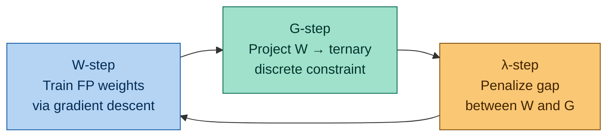
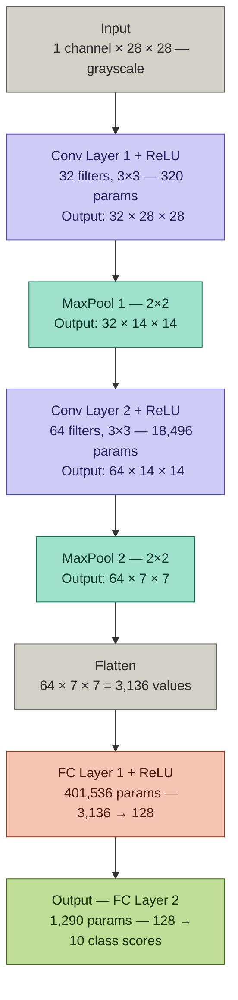

<p align="center">
  
</p>

# Extremely Low-Bit Neural Networks: Squeeze the Last Bit Out with ADMM

<div align="center">

[](https://www.python.org/)
[](https://pytorch.org/)
[](https://www.mathworks.com/)
[](LICENSE)

**Group-D4 | Mathematics for Computing – 4 | Amrita Vishwa Vidyapeetham**

</div>

---

## Team Members

| Name | Roll Number |
|------|------------|
| Nethra R | CB.SC.U4AIE24147 |
| Dheeraj S | CB.SC.U4AIE24050 |
| Raaman Namputhiri | CB.SC.U4AIE24149 |
| Jyothsna | CB.SC.U4AIE24117 |
---

## Table of Contents

1. [Introduction & Motivation](#1-introduction--motivation)
2. [Problem Statement](#2-problem-statement)
3. [Insights into Quantization — QAT vs PTQ](#3-insights-into-quantization--qat-vs-ptq)
4. [Straight-Through Estimator (STE)](#4-straight-through-estimator-ste)
5. [Solving with ADMM](#5-solving-with-admm)
6. [Optimization Problem Formulation](#6-optimization-problem-formulation)
7. [Augmented Lagrangian](#7-augmented-lagrangian)
8. [ADMM Update Equations](#8-admm-update-equations)
9. [Dataset Description](#9-dataset-description)
10. [Case Study: CNN Architecture on MNIST](#10-case-study-cnn-architecture-on-mnist)
11. [Results & Final Summary](#11-results--final-summary)
12. [Raspberry Pi Deployment](#12-raspberry-pi-deployment)
13. [Conclusion](#13-conclusion)
14. [Execution Time & Platform Info](#14-execution-time--platform-info)
15. [Repository Structure](#15-repository-structure)
16. [References](#16-references)

---

## 1. Introduction & Motivation

Modern deep neural networks are accurate but **extremely heavy** in memory and computation, making them impractical for edge devices, embedded systems, and low-power hardware.

### The Core Idea

> Compress neural networks by forcing weights to use only **1 or 2 bits** (binary or ternary) instead of 32-bit floating point numbers.

If weights are only $\{-1, 0, +1\}$ or $\{-1, +1\}$, then:

- Multiplications are replaced by **additions and bit operations**
- Memory usage drops by **16x to 32x**
- Inference becomes **much faster and energy-efficient**

### Why Not Just Round Weights?

Naively rounding weights **destroys accuracy** because training neural networks with discrete constraints is a hard **non-convex combinatorial optimization** problem.

The problem is reformulated as:

$$\min_W f(W) \quad \text{subject to: } W \in \{-1, 0, +1\}$$

This is **NP-hard** if solved directly. Thus, we use **ADMM**.

---

## 2. Problem Statement

```
32-bit Floating Point Weights
         |
  High memory usage
  High bandwidth cost
  High energy consumption
         |
  NOT suitable for edge devices
```

### The Challenge

- Edge devices, embedded systems, and specialized accelerators **cannot afford** 32-bit FP arithmetic.
- Restricting weights to binary/ternary introduces **discrete constraints** into training.
- Training with discrete-valued parameters makes the optimization **non-differentiable** — the `sign()` function has zero gradient almost everywhere.

---

## 3. Insights into Quantization — QAT vs PTQ

There are two main approaches to quantizing a neural network:

<p align="center">
  
</p>


### QAT vs PTQ Comparison

| Feature | QAT (Quantization Aware Training) | PTQ (Post Training Quantization) |
|---------|----------------------------------|----------------------------------|
| **How it works** | Introduces "fake rounding" during training. The model sees the low-precision errors and updates its weights to compensate. | Takes a fully trained model and forcefully rounds weights to 8-bit. A tiny calibration batch is passed through to fix the rounding math. |
| **Pros** | Excellent accuracy — the final quantized model performs almost identically to the full-precision one. | Takes **minutes** and requires almost no compute or data. |
| **Cons** | Takes hours/days — requires a full training loop over the entire dataset. | The model cannot adjust to sudden rounding errors, so it often loses accuracy. |
| **When to use** | When maximum accuracy is needed and training time/data is available. | When rapid deployment is needed and a slight accuracy drop is acceptable. |

> **Note:** *Calibration* is the process of determining the optimal clipping range (min/max values) for converting activations from floating-point to lower-precision integers.

---

## 4. Straight-Through Estimator (STE)

### The Zero Gradient Problem

When you quantize a network, you use a `round()` function to turn decimals into whole numbers (e.g., 3.14 → 3). The mathematical derivative of a staircase rounding function is **exactly zero** almost everywhere — so backpropagation stops dead and the network learns nothing.

### How STE Solves It

<p align="center">
  
</p>

- **(a) Forward Pass:** The model applies the hard rounding function to squish weights into low-bit integers — $w = 2.7$ becomes $\hat{w} = 3$.
- **(b) Backward Pass:** STE completely ignores the rounding step and passes the gradient **straight through** as if it were a normal continuous line.

where :
- w → the original continuous weight
- ŵ → the rounded/quantized version of it

**Key Insight:** STE uses the rounded value $\hat{w}$ to **predict**, but the original smooth value $w$ to **learn**.

---

## 5. Solving with ADMM

ADMM (Alternating Direction Method of Multipliers) converts one impossible problem into **three manageable subproblems**:


 
---

### Why a Scaling Factor?

The projection step uses $W \approx \alpha \cdot Q$ where $Q \in \{-1, 0, +1\}$ and $\alpha$ is a **learned scaling factor**.

<p align="center">
  
</p>

Without the scaling factor (a), the constrained space is just a few fixed discrete points. With the scaling factor (b), it expands to **rays through the origin** — giving ADMM far more flexibility during optimization without losing the discrete structure.

---

## 6. Optimization Problem Formulation

### Original Constrained Problem

$$\min_W f(W) \quad \text{s.t.} \quad W \in \mathcal{C} = \{-1, 0, +1\}^d$$

More generally for $N$-bit quantization:

$$\mathcal{C} = \{-2^N, \cdots, -2^1, -2^0, 0, +2^0, +2^1, \cdots, +2^N\}$$

where:
- $W$ = network weights
- $f(W)$ = training loss (cross-entropy)
- The constraint makes the problem **discrete and non-differentiable** — NP-hard

### Reformulation via Auxiliary Variable

Introduce $G$ — an auxiliary variable representing the quantized ternary weights:

$$\min_{W,G} \quad f(W) + I_{\mathcal{C}}(G) \quad \text{s.t.} \quad W = G$$

where $I_{\mathcal{C}}(G) = 0$ if $G \in \mathcal{C}$, else $+\infty$.

This splits the problem cleanly: $W$ handles the continuous loss minimization, $G$ handles the discrete constraint — and they are gradually forced to agree.

---

## 7. Augmented Lagrangian

The Augmented Lagrangian ties the two subproblems together with a penalty:

$$\boxed{L_\rho(W, G, \lambda) = f(W) + I_{\mathcal{C}}(G) + \frac{\rho}{2}\|W - G + \lambda\|^2 - \frac{\rho}{2}\|\lambda\|^2}$$

- $\lambda$ = dual variable — accumulates the error between $W$ and $G$, enforcing the constraint
- $\rho$ = penalty parameter — controls how strictly $W = G$ is enforced

---

## 8. ADMM Update Equations

### W-Update (Continuous Optimization)

$$W^{k+1} := \arg\min_W \; L_\rho(W, G^k, \lambda^k)$$

The gradient of the Lagrangian w.r.t. $W$:

$$\partial_W L = \partial_W f + \rho(W - G^k + \lambda^k)$$

This is a standard gradient descent step with an extra quadratic penalty term pulling $W$ toward $G$:

$$W^{k+1} = \arg\min_W \left[ f(W) + \frac{\rho}{2}\|W - G^k + \lambda^k\|^2 \right]$$

---

### G-Update (Discrete Projection)

$$G^{k+1} := \arg\min_G \; L_\rho(W^{k+1}, G, \lambda^k)$$

Let $V = W + \lambda$. Substitute $G = \alpha Q$ where $Q \in \{0, \pm1\}$. We solve:

$$\min_{\alpha, Q} \|V - \alpha Q\|^2$$

**Deriving the optimal $\alpha$:**

$$\frac{d}{d\alpha}\|V - \alpha Q\|^2 = -2V^TQ + 2\alpha Q^TQ = 0$$

$$\boxed{\alpha_i = \frac{V_i^T Q_i}{Q_i^T Q_i}}$$

With $\alpha$ fixed, update $Q$ by rounding each element to the nearest value in $\{-1, 0, +1\}$:

$$Q_i = \Pi_{\{0, \pm1\}}\left(\frac{V_i}{\alpha_i}\right)$$

---

### Numerical Walkthrough: G-Step Projection

Suppose the pre-projected tensor (after $V = W + \lambda$) is:

$$V = \begin{bmatrix} 1.1 \\ -2.3 \\ 0.8 \\ 6.1 \end{bmatrix}$$

**Step 1 — Initialize $Q$ using the sign of $V$:**

$$Q = \text{sign}(V) = \begin{bmatrix} +1 \\ -1 \\ +1 \\ +1 \end{bmatrix}$$

**Step 2 — Compute the optimal scaling factor $\alpha$:**

$$V^T Q = (1.1)(1) + (-2.3)(-1) + (0.8)(1) + (6.1)(1) = 10.3$$

$$Q^T Q = 1 + 1 + 1 + 1 = 4 \quad \Rightarrow \quad \alpha = \frac{10.3}{4} = 2.575$$

**Step 3 — Re-project $V/\alpha$ to nearest ternary value (threshold at $\pm 0.5$):**

$$\frac{V}{\alpha} = \begin{bmatrix} 0.43 \\ -0.89 \\ 0.31 \\ 2.37 \end{bmatrix}$$

| $V_i / \alpha$ | Rule | $Q_i$ |
|:-:|:-:|:-:|
| $0.43$ | between $-0.5$ and $+0.5$ | $0$ |
| $-0.89$ | $< -0.5$ | $-1$ |
| $0.31$ | between $-0.5$ and $+0.5$ | $0$ |
| $2.37$ | $> +0.5$ (clipped to max) | $+1$ |

$$Q^{\text{new}} = \begin{bmatrix} 0 \\ -1 \\ 0 \\ +1 \end{bmatrix}$$

**Step 4 — Recompute $\alpha$ with the updated $Q$:**

$$V^T Q^{\text{new}} = (1.1)(0)+(-2.3)(-1)+(0.8)(0)+(6.1)(1) = 8.4, \quad Q^TQ = 2$$

$$\alpha^{\text{new}} = \frac{8.4}{2} = 4.2$$

**Final Result:**

$$G = 4.2 \times \begin{bmatrix} 0 \\ -1 \\ 0 \\ +1 \end{bmatrix} = \begin{bmatrix} 0 \\ -4.2 \\ 0 \\ +4.2 \end{bmatrix}$$

The original continuous weights $[1.1,\ -2.3,\ 0.8,\ 6.1]$ are now stored as just **one scalar** $\alpha = 4.2$ and **four integers** $\{0, -1, 0, +1\}$.

---

### Code: Ternary Projection in PyTorch

```python
def project_ternary(V, iters=5, eps=1e-8):
    """
    ADMM G-step: projects continuous tensor V onto ternary set {-alpha, 0, +alpha}

    Args:
        V    : continuous tensor  (W + Lambda)
        iters: alternating optimization iterations
        eps  : numerical stability constant

    Returns:
        G = alpha * Q   (quantized tensor)
        alpha           (learned scale factor)
    """
    alpha = V.abs().mean() + eps    # initialize alpha as mean absolute value
    Q = torch.zeros_like(V)

    for _ in range(iters):
        Q.zero_()
        Q[V / alpha >  0.5] =  1.0  # above threshold  -> +1
        Q[V / alpha < -0.5] = -1.0  # below threshold  -> -1
        #  between -0.5 and +0.5   -> 0  (stays zero)

        alpha = (V * Q).sum() / (Q.pow(2).sum() + eps)  # closed-form optimal alpha

    return alpha * Q, alpha
```

---

### lambda-Update (Dual Variable)

$$\lambda^{k+1} := \lambda^k + W^{k+1} - G^{k+1}$$

- If $W^{k+1}$ and $G^{k+1}$ are **close** — small update, constraint nearly satisfied
- If they are **far apart** — $\lambda$ increases, applying **stronger penalty** in the next W-update
- This self-correcting mechanism gradually drives $W$ into the discrete set

---

## 9. Dataset Description

### MNIST

| Property | Value |
|----------|-------|
| Instances | 70,000 images |
| Image Size | 28×28 pixels |
| Channels | 1 (Grayscale) |
| Classes | 10 (Digits 0–9) |
| Training Images | 60,000 |
| Test Images | 10,000 |
| Pixel Range | 0 to 255 (intensity) |

### CIFAR-10

| Property | Value |
|----------|-------|
| Instances | 60,000 images |
| Image Size | 32×32 pixels |
| Channels | 3 (RGB) |
| Classes | 10 |
| Training Images | 50,000 |
| Test Images | 10,000 |
| Class Labels | Airplane, Automobile, Bird, Cat, Deer, Dog, Frog, Horse, Ship, Truck |

---

## 10. Case Study: CNN Architecture on MNIST

> **For the complete architecture breakdown of all the baseline (FP) models and the quantized versions of it on the datasets MNIST and CIFAR-10 , step-by-step layer explanations, and parameter tables for every model — look into the [Architecture Reference →](architecture.md)** , while the simple architecture of the MNIST digits is shown here for a quick overview. (Skip it, if you've gone through the architecture file)
### Overview

The model is a **4-layer CNN — 2 Convolutional layers + 2 Fully Connected layers**.

The convolutional layers learn spatial features directly from the image pixels (edges, shapes, textures). The fully connected layers then use those features to classify the image into one of 10 digit classes. Each conv layer is followed by a ReLU activation (introduces non-linearity) and a MaxPool layer (halves the spatial size, retaining the most important features).

---

### Step-by-Step Data Flow

## Architecture — SimpleCNN (MNIST)


 
---

**Step 1 — Input**

A single grayscale handwritten digit image enters the network.

```
Input shape:  1 channel x 28x28 pixels
```

---

**Step 2 — Conv Layer 1**

32 small 3×3 filters slide across the image, each detecting a different low-level feature (edges, corners). `padding=1` keeps spatial size unchanged.

```
Weights:  32 filters x (1 channel x 3x3) = 288
Biases:   32
Output shape:  32 x 28 x 28
```

Followed by **ReLU** — sets all negative activations to zero.

---

**Step 3 — MaxPool 1**

A 2×2 max pooling takes the maximum value in each 2×2 block, halving both spatial dimensions. No learnable parameters — just a downsampling operation.

```
Output shape:  32 x 14 x 14
```

---

**Step 4 — Conv Layer 2**

64 filters of size 3×3 operate on the 32-channel feature maps. This layer builds higher-level features — combinations of the edges and textures found in layer 1.

```
Weights:  64 filters x (32 channels x 3x3) = 18,432
Biases:   64
Output shape:  64 x 14 x 14
```

Followed by **ReLU**.

---

**Step 5 — MaxPool 2**

Second max pooling, again halving spatial dimensions.

```
Output shape:  64 x 7 x 7
```

---

**Step 6 — Flatten**

The 3D feature map is reshaped into a single 1D vector to feed into the fully connected layers.

```
64 x 7 x 7 = 3,136 values
```

---

**Step 7 — FC Layer 1**

Every one of the 3,136 inputs connects to every one of 128 neurons. Each neuron computes a weighted sum of all features — this is the most parameter-heavy layer in the network.

```
Weights:  128 x 3,136 = 401,408
Biases:   128
Output shape:  128
```

Followed by **ReLU**.

---

**Step 8 — FC Layer 2 (Output)**

Maps 128 features to 10 output scores, one per digit class. The class with the highest score is the network's prediction.

```
Weights:  10 x 128 = 1,280
Biases:   10
Output shape:  10
```

---

### 10.1 FP32 Baseline — Layer-wise Parameter Table

| Layer / Output Shape | Values | Total Weights | Biases | Total Parameters | Activation Memory (bytes) | Parameter Memory (32-bit, bytes) |
|---|---|---|---|---|---|---|
| Input — 1 × 28 × 28 | 0 | 0 | 0 | 0 | 1 × 28 × 28 × 4 = 3,136 | 0 |
| conv1 + ReLU — 32 × 28 × 28 | 32 × 1 × 3 × 3 | 288 | 32 | 320 | 32 × 28 × 28 × 4 = 100,352 | 320 × 4 = 1,280 |
| pool1 (MaxPool) — 32 × 14 × 14 | 0 | 0 | 0 | 0 | 32 × 14 × 14 × 4 = 25,088 | 0 |
| conv2 + ReLU — 64 × 14 × 14 | 64 × 32 × 3 × 3 | 18,432 | 64 | 18,496 | 64 × 14 × 14 × 4 = 50,176 | 18,496 × 4 = 73,984 |
| pool2 (MaxPool) — 64 × 7 × 7 | 0 | 0 | 0 | 0 | 64 × 7 × 7 × 4 = 12,544 | 0 |
| Flatten + fc1 + ReLU — 128 | 128 × 3,136 | 401,408 | 128 | 401,536 | 128 × 4 = 512 | 401,536 × 4 = 1,606,144 |
| fc2 — 10 | 10 × 128 | 1,280 | 10 | 1,290 | 10 × 4 = 40 | 1,290 × 4 = 5,160 |
| **Totals** | | **421,408** | **234** | **421,642** | **191,848 bytes** | **1,686,568 bytes ≈ 1.68 MB** |

---

### 10.2 After ADMM Quantization — Layer-wise Parameter Table

In ADMM ternary quantization, each weight is stored as an `int8` value ($-1$, $0$, or $+1$) plus one `FP32` scaling factor $\alpha$ per layer — instead of a full 32-bit float per weight.

| Layer / Output Shape | Values | Total Weights | Biases | Weight Memory (int8 + fp32 α) | Activation Memory (bytes) | Parameter Memory (bytes) |
|---|---|---|---|---|---|---|
| Input — 1 × 28 × 28 | 0 | 0 | 0 | 0 | 1 × 28 × 28 × 4 = 3,136 | 0 |
| conv1 + ReLU — 32 × 28 × 28 | 32 × 1 × 3 × 3 | 288 | 32 | 292 | 32 × 28 × 28 × 4 = 100,352 | 420 |
| pool1 (MaxPool) — 32 × 14 × 14 | 0 | 0 | 0 | 0 | 32 × 14 × 14 × 4 = 25,088 | 0 |
| conv2 + ReLU — 64 × 14 × 14 | 64 × 32 × 3 × 3 | 18,432 | 64 | 18,436 | 64 × 14 × 14 × 4 = 50,176 | 18,692 |
| pool2 (MaxPool) — 64 × 7 × 7 | 0 | 0 | 0 | 0 | 64 × 7 × 7 × 4 = 12,544 | 0 |
| Flatten + fc1 + ReLU — 128 | 128 × 3,136 | 401,408 | 128 | 401,412 | 128 × 4 = 512 | 401,924 |
| fc2 — 10 | 10 × 128 | 1,280 | 10 | 1,284 | 10 × 4 = 40 | 1,324 |
| **Totals** | | **421,408** | **234** | **421,642** | **191,848 bytes** | **422,360 bytes ≈ 422 KB** |

---

### 10.3 FP32 vs ADMM Ternary — Key Metrics

| Metrics | FP32 Baseline | ADMM Ternary Quantized |
|---------|--------------|------------------------|
| Training time | 352.01 secs | 1,326.04 secs |
| Memory Footprint | 1.68 MB (1,686,568 bytes) | 422 KB (422,360 bytes) |
| Accuracy | **99.06%** | **98.92%** |

**~4x memory compression with only 0.14% accuracy drop.**

---

## 11. Results & Final Summary

### MNIST — Complete Framework Comparison

> **Note:** MATLAB's Deep Learning Toolbox automatically uses single precision (32-bit) for neural networks.

| Dataset | Metrics | PyTorch FP32 | MATLAB FP32 | PyTorch ADMM | MATLAB ADMM |
|---------|---------|-------------|------------|-------------|------------|
| **MNIST** | Bits | 32 | 32 | 2 | 3 |
| | No. of parameters | 421,642 | 101,770 | 421,642 | 101,770 |
| | Weights | 421,402 | 32,584 | 421,408 | 101,632 |
| | Activation | 191,848 bytes | 47,080 bytes | 191,848 bytes | 7,376 bytes |
| | **Memory footprint** | **1.68 MB** | **~130.6 KB** | **422 KB** | **102.7 KB** |
| | Training time | 352.01 secs | 108 secs | 1,326.04 secs | 21.56 secs |
| | Layers | CNN (4 layers) | CNN (3 layers) | CNN (4 layers) | MLP (2 layers) |
| | **Accuracy** | **99.06%** | **97.03%** | **98.92%** | **88.82%** |
| | Hardware | GPU (CUDA) | GPU | GPU (CUDA) | CPU |

---

### CIFAR-10 — Complete Framework Comparison

| Dataset | Metrics | PyTorch FP32 | MATLAB FP32 | PyTorch ADMM | MATLAB ADMM |
|---------|---------|-------------|------------|-------------|------------|
| **CIFAR-10** | Bits | 32 | 32 | 2 | — |
| | No. of parameters | 1,147,466 | 620,810 | 1,147,466 | 620,810 |
| | Weights | 1,146,720 | 619,872 | 1,146,720 | 619,872 |
| | Activation | ~301,096 bytes | 287,784 bytes | ~301,096 bytes | 287,784 bytes |
| | **Memory footprint** | **~4.59 MB** | **~2.48 MB** | **~1.15 MB** | **~0.62 MB** |
| | Training time | 390.264 secs | ~350 secs | 464.04 secs | N/A (PTQ) |
| | Layers | CNN (5 layers) | CNN (5 layers) | CNN (5 layers) | CNN (5 layers) |
| | **Accuracy** | **81.74%** | **79.30%** | **80.09%** | **79%** |

**CIFAR-10 Quantized Memory Breakdown (PyTorch):**
- Weights: 1,146,720 × 1 byte (int8) = **1,146,720 bytes**
- Alphas: 5 layers × 4 bytes (FP32) = **20 bytes**
- Biases: 746 × 4 bytes (FP32) = **2,984 bytes**
- **Total = 1,149,724 bytes ≈ 1.15 MB**

---


## 12. Raspberry Pi Deployment

## Pi deployment Demo Video to show the prediction in command prompt 

[Watch the Demo Video](https://drive.google.com/file/d/14iPGiHrIfNUiqpPp4u9pAwDvBFzaNIW8/view?usp=sharing)

Edge devices like the Raspberry Pi have **limited RAM, power, and compute**, making standard 1.68 MB FP32 models slow and inefficient to run.

### Deployment Pipeline

```
MATLAB Training
      |
      v
classify_mnist_int8.m          <-- custom integer-only forward pass
      |
      v
MATLAB Coder
codegen -config cfg ...        <-- transpile to standalone C++ binary
      |
      v
Optimized C++ binary on Pi     <-- bypasses the Pi's slow FPU entirely
                                    uses int32 accumulators + bit-shifting
```

### Why Integer-Only Inference?

| Feature | FP32 Model | Quantized INT8 Model |
|---------|-----------|---------------------|
| Memory | 1.68 MB | 422 KB (~4x smaller) |
| Computation | Floating point (slow on Pi) | Integer only (fast) |
| FPU Usage | Yes (bottleneck on Pi) | Bypassed entirely |
| Accuracy | 99.06% | 98.92% |

---

## 13. Conclusion

✅ ADMM enables **stable training** of neural networks with ternary weights.

✅ The optimization is **cleanly decomposed** into continuous (W-step) and discrete (G-step) subproblems.

✅ **High accuracy is preserved** despite extreme weight quantization — only 0.14% drop on MNIST.

✅ **~4x memory compression** on both MNIST and CIFAR-10.

✅ The ternary model is **suitable for low-end devices** like Raspberry Pi.

✅ The approach **reduces computational complexity** — multiplications become additions and bit-shifts.

---

## 14. Execution Time & Platform Info

### MNIST (PyTorch)

| Phase | Platform | Hardware | Time |
|-------|----------|---------|------|
| FP32 Baseline Training (5 epochs) | Local Laptop / Kaggle | GPU (CUDA) | **352.01 seconds** |
| ADMM Ternary Training (20 epochs) | Local Laptop / Kaggle | GPU (CUDA) | **1,326.04 seconds** |

### MNIST (MATLAB)

| Phase | Platform | Hardware | Time |
|-------|----------|---------|------|
| FP32 Baseline Training | Local Laptop | GPU | **108 seconds** |
| ADMM Ternary Training | Local Laptop | CPU | **21.56 seconds** |

### CIFAR-10 (PyTorch)

| Phase | Platform | Hardware | Time |
|-------|----------|---------|------|
| FP32 Baseline Training | Local Laptop / Kaggle | GPU (CUDA) | **390.264 seconds** |
| ADMM Binary Training (scratch) | Local Laptop / Kaggle | GPU (CUDA) | **461 seconds** |
| ADMM Binary Training (pretrained) | Local Laptop / Kaggle | GPU (CUDA) | **468 seconds** |

### CIFAR-10 (MATLAB)

| Phase | Platform | Hardware | Time |
|-------|----------|---------|------|
| FP32 Baseline Training | Local Laptop | GPU | **~350 seconds** |

### PINV (MATLAB)

| Phase | Platform | Hardware | Time |
|-------|----------|---------|------|
| PINV Ternary (MNIST) | Local Laptop | CPU | **638.64 seconds** |

### How Timing is Measured

**Python (PyTorch):**
```python
import time

start_time = time.time()
# ... training loop ...
end_time = time.time()
print(f"Training Time: {end_time - start_time:.2f} seconds")
```

**MATLAB:**
```matlab
tic;
% ... training loop ...
elapsed = toc;
fprintf('Training Time: %.2f seconds\n', elapsed);
```

---

## 15. Repository Structure

```
D4_MFC4_LowBitNNs/
├── assets/
│   ├── qat_ptq_diagram.png        # QAT vs PTQ flowchart (from PPT slide 5)
│   ├── ste_diagram.png            # STE Forward/Backward pass diagram (from PPT slide 9)
│   └── scaling_factor.png         # Ternary scaling factor visualization (from PPT slide 13)
├── 00_base_papers/                # Base and reference research papers
├── 01_docs/                       # Project PPT and documentation
├── 02_PyTorch/
│   └── FP32/                      # Standard full-precision PyTorch implementations
|   └── Low_bit_ADMM/              # ADMM-based low-bit quantization experiments.
├── 03_MATLAB/                     # MATLAB experiments for quantization
├── 04_PINV/                       # Pseudoinverse based experiments
├── 05_INT_8_pi_deployment         # quantized model deployment files Raspberry pi
├── requirements.txt               # Python dependencies
└── architecture.md
└── README.md                      # This file
```

### Framework vs Dataset Coverage

| Dataset | Python (FP) | Python (Quantized) | MATLAB (FP) | MATLAB (Quantized) |
|---------|------------|-------------------|------------|-------------------|
| MNIST | ✅ | ✅ | ✅ | ✅ |
| CIFAR-10 | ✅ | ✅ | ✅ | ✅ |

---

## 16. References

1. **[Extremely Low Bit Neural Network: Squeeze the Last Bit Out with ADMM](https://arxiv.org/abs/1707.09870)** — Cong Leng et al., AAAI 2018 *(Main Base Paper)*

2. **[Ternary Weight Networks (TWN)](https://arxiv.org/abs/1605.04711)** — Li et al.

3. **[Quantized Neural Networks: Training Neural Networks with Low Precision Weights and Activations](https://www.jmlr.org/papers/volume18/16-456/16-456.pdf)** — Hubara et al., JMLR 2018

4. **[BinaryConnect: Training Deep Neural Networks with Binary Weights during Propagations](https://arxiv.org/abs/1511.00363)** — Courbariaux et al., NeurIPS 2015

5. **[1-bit LLM: The Era of 1-bit Large Language Models (BitNet b1.58)](https://arxiv.org/abs/2402.17764)** — Ma et al., 2024

6. **[MNIST Dataset](https://www.kaggle.com/datasets/hojjatk/mnist-dataset)** — Kaggle

---

<div align="center">

**Group-D4 | Amrita Vishwa Vidyapeetham | MFC-4 | 2024–2025**

*"Squeeze the last bit out — and still get the right answer."*

</div>
